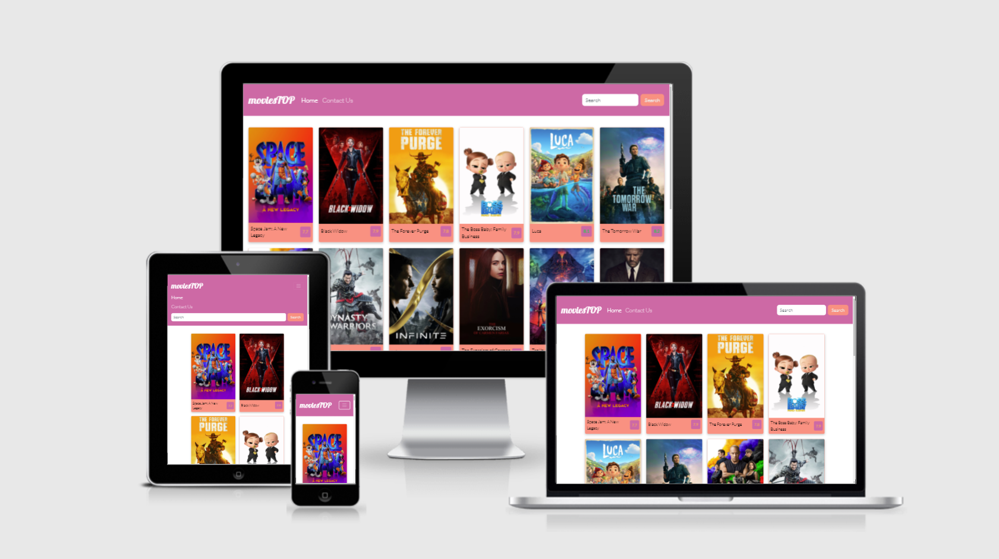
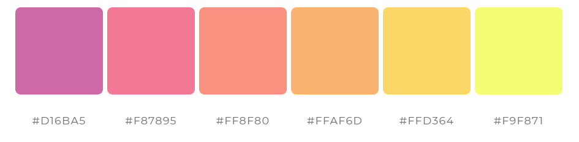
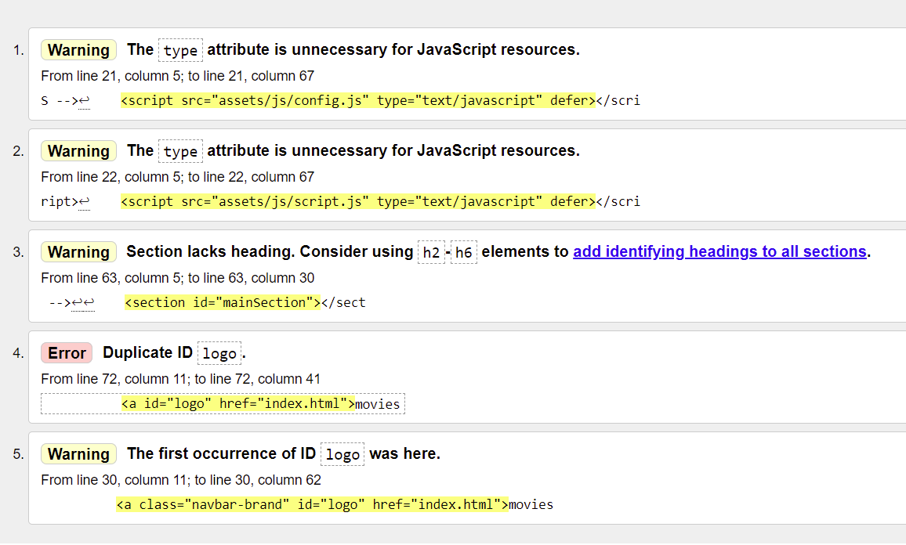
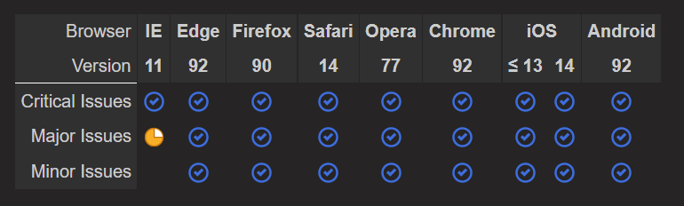
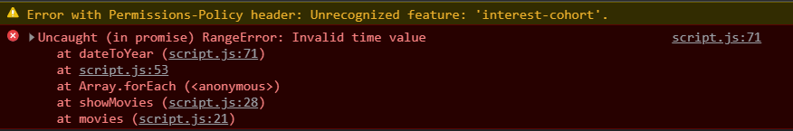
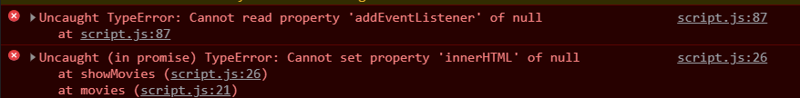

# Movies Info App

**Github Repository:** [https://github.com/sscip/movie-app-ms2](https://github.com/sscip/movie-app-ms2)

**Deployed Project:** [https://sscip.github.io/movie-app-ms2/](https://sscip.github.io/movie-app-ms2/)

<br>

# Idea/Description

I was thinking for quite some time, what to do as my Second Milestone Project for Code Institute. Did a little bit of practice following up some [videos](https://www.youtube.com/watch?v=dtKciwk_si4) and came up with this idea to create a movie app with pulling posters, description, titles, score, trailers and so on from API up to "rent or buy a movie" or "find a cinema". This is just a beginning of full potential if this web application, but my Mentor said it is enough for MS2 already. So here we are.



# Potential Website users

This web application, potentially a service, was created for people to find their favorite movies, see what is on at the moment and familiarize them selves with movie description, score and find out where and how to watch their favorite movie.

# Owners Goals 

Service would be owned by the owner and used for informative and entertainment purposes for their clients. 

# User Stories
1. A new visitor, I want them to:
    * to understand what business does;
    * to navigate easily and intuitively across the web application;
    * to answer their questions before they have any.
2. A potential/interested client should:
    * find easily what he/she is looking for by using "Search" option;
    * understand what service they can use and how;
    * understand a contact form in case they have questions;
3. A returning client can quickly find:
    * how to navigate to required service and use "Search" option intuitively and easy;
    * appropriate movie information they are interested in;
    * how to contact management in case of bugs, issues or other questions.

# 5 UX Planes

## Strategy Plane

Web application is created with a streaming service idea behind it, providing movies top at the beginning and search function for potential customers to find their favorite movies.
  
  * Main aim is to provide clear understanding of services and how to contact management team for any assistance needed.

Please see a table below to see what website should contain for users value. There were some ideas are not implemented due to lack of skill, time and requirement frames of this project.

| Opportunity   | Importance    | Viability/Feasibility |
| ------------- |:-------------:| :-----:|
| Services offered | 5 | 5 |
| Search | 5 | 5 |
| Rating | 3 | 2 |
| Feedback | 3 | 1 |
| Increase Social Media Activity | 3 | 1 |
| Where to watch [^1] | 4 | 3 |
| Buy/Rent a movie [^2] | 4 | 4 |
| Movies trailers [^3] | 3 | 3 |
| Personalized/Recommended [^4] | 2 | 1 |

> Ideas marked with a footnote are some of the potential ones that could be implemented if there would be more time for the project.

[^1]: I was thinking to figure a cinemas API to provide information where to watch a movie using customers location.

[^2]: If movie is out in digital format - could link up to an existing service or buy rights (as I would imagine) to sell or rent digital copies of older movies.

[^3]: This is easy to implement, but API I used does not have any trailers or videos available, therefore I used other poster in modal instead. Did not want to waste time on looking for other API and mess things around. Will avoid this next time with better project planning.

[^4]: A big job this one, as I was thinking of login option and record people's preferences and show them personalized or recommended movies for them using movie genres. I did not implement Genres in modal, as this project is to show my skills, and it is clearly seen that I know how to pull objects out of API. 

> Not sure why footnotes are not working correctly, as it did work with first one and then after adding second it came out like this. Here is a [resource](https://www.markdownguide.org/cheat-sheet/) I used.

## Scope Plane

What features this project should include:
  * Landing page with top 20 of trending movies (page 1 from API), search option for older movies.
  * Modal with movie information.
  * Contact form to report any issues, ask questions.
  * Lots of other potential, but as mentioned above, was not included due to variety of reasons.

## Structure Plane

At this stage web application contains 2 pages and a modal on each page (as mentor advised - this is enough for now). Every page has navigation, footer and main section relative to each page.

**Home:** Home page shows top 20 of latest movies that came out recently, pulling information from API, has search to look for desired movies. 

**Modal:** At this stage modal shows second poster (substitute to trailer, as API does not supply any trailers), movie description and release date (transformed to better readable format using JavaScript functionality.)

**Contact Us:** Basic contact form made with Bootstrap 5 and EmailJS.

> As I wanted to implement a pop-up on form submission in MS1 but couldn't due to lack of knowledge - managed to do it here, comes up on success or error.

## Skeleton Plane

Web application created for all size devices, responsive design was achieved by using Bootstrap 5, so there was almost no need to use media queries in CSS.

Wireframes:

| Page | Desktop | Mobile |
| :--- | :--: | :--: |
| Home | [View](assets/img/wireframe-1.png) | [View](assets/img/wireframe-3.png) |
| Home - Modal | [View](assets/img/wireframe-1-1.png) | [View](assets/img/wireframe-3-1.png) |
| Contact us | [View](assets/img/wireframe-2.png) | [View](assets/img/wireframe-4.png) |
| Contact us - Modal | [View](assets/img/wireframe-2-1.png) | [View](assets/img/wireframe-4-1.png) |


## Surface Plane

### Background

Plain white background, for better contrast.

### Colors

I used [ColorSpace](https://mycolor.space/) to create a color palette. 



### Fonts 

Used [Google Fonts](https://fonts.google.com/) for this web application. 

**Lobster** - for logo.

**Lato** - for text.

### Navigation and Form

Used [Bootstrap 5](https://getbootstrap.com/docs/5.0/getting-started/introduction/) for convenience and responsive design.

## Features

### Implemented Features
  * Web application contains 2 pages and each page has a modal. Home has modal with movie description and Contact Us page has 2 modals for successful submission and error.
  * Created by using HTML, CSS and Javascript, as well as Bootstrap 5 and jQuery 3.6 frameworks in addition with [EmailJS](https://www.emailjs.com/) for contact form to work and [TMDB](https://www.themoviedb.org/) for movie API. Added Google Fonts and FontAwesome for projects fonts and icons.
  * Application is taking Poster image, Title, Rating, Description, Release Date and Second poster from API.

### Potential Features to Add
  * Trailers for movie preview modal.
  * Where to watch based on movie theaters around customers location.
  * If movie is out and not in theater - Buy/Rent or Watch Now option.
  * Login option, for customers convenience as well as track of bought/rented movies, generating recommendations based on previous movie experience.
  * Writing reviews and comments on movies.

## Technologies Used

|Technology|Reason|
| :-- | :-- |
| [HTML](https://www.w3schools.com/html/) | Markup |
| [CSS](https://www.w3schools.com/css/) | Styling |
| [JavaScript](https://www.w3schools.com/js/) | Interactive Frontend |
| [Bootstrap 5](https://getbootstrap.com/docs/5.0/getting-started/introduction/) | Navbar, Forms, Modals |
| [jQuery 3.6](https://jquery.com/) | DOM manipulation in some cases |
| [EmailJS](https://www.emailjs.com/)  | Contact Us functionality |
| [TMDB](https://www.themoviedb.org/) | Movie database API |

## Resources

### Resources used
+ Code Institute Course Material
+ Code Institute's Slack Community
+ [W3Schools](https://www.w3schools.com/) - Minor CSS and JavaScript code ideas
+ [Stack Overflow](https://stackoverflow.com/) - Problem resolution, credited below
+ [jQuery](https://learn.jquery.com/using-jquery-core/) - jQuery documentation
+ [EmailJS](https://www.emailjs.com/) - EmailJS documentation
+ [TMDB](https://www.themoviedb.org/) - Movie Database documentation
+ [YouTube](https://www.themoviedb.org/) - Project idea and some bits of code


### Tools Used
+ [Git](https://git-scm.com/book/en/v2/Getting-Started-About-Version-Control) - Local Repository/Version Control
+ [GitHub](https://github.com/) - Remote repository and deployment
+ [VSCode](https://code.visualstudio.com/) - IDE
+ [HTML Validator](https://validator.w3.org/) - HTML Testing
+ [CSS Validator](https://jigsaw.w3.org/css-validator/) - CSS Testing
+ [Am I Responsive](http://ami.responsivedesign.is/) - Responsive Webpage Presentation
+ [Balsamiq](https://balsamiq.com/wireframes/) - Creating wireframes
+ [MS Paint](https://support.microsoft.com/en-us/windows/get-microsoft-paint-a6b9578c-ed1c-5b09-0699-4ed8115f9aa9) - Cutting out wireframes and screenshots
+ [PowerMapper](https://www.powermapper.com/) - Browser compatibility checks
+ [ColorSpace](https://mycolor.space/) - Palette generator

## Testing

### Pre-testing

While creating application I used Chrome Developer Tools to check on errors straight after applying any changes or adding anything new, as well as checking application's **responsiveness**.

### Main Testing

+ **HTML** code was tested by [HTML Validator](https://validator.w3.org/)

> **Errors found and fixed in** [index.html](index.html):

```
Stray start tag footer.

From line 71, column 1; to line 71, column 8

oter -->↩↩<footer>↩  <di 
```


> Type warnings - not sure, as in any documentation they are present - removed as advised.

> Duplicate "logo" - changed footer logo id - fixed.

**Other errors/warnings:**

**Heading warning** - not sure if heading is needed as main section is generated using JavaScript.

> **No errors or warnings found in** [contact.html](contact.html):

After finding errors in index.html, I fixed them in contact.html also, then made a check and no other errors were found.

* **CSS** code was tested by [CSS Validator](https://jigsaw.w3.org/css-validator/validator)

**No errors found!**

<br>

### Lighthouse Reports

Reports generated on [deployed project](https://sscip.github.io/movie-app-ms2/index.html):

* [index.html](index.html)

| Test | Mobile | Desktop |
| :-- | :--: | :--: |
| Performance     | 68 | 85 |
| Accessibility   | 83 | 84 |
| Best Practices  | 93 | 93 |
| SEO             | 83 | 90 |


> Test showed long loading time on images, I tried to figure out some solutions to rescale image on loading to improve web app's loading speed, but due to lack of experience and time couldn't implement it at this time. Shows contrast ratio on movie ratings, tried to fix that, made numbers brighter and added transparency to background, to keep the color, but still error persists. Added keywords and description to index.html and contact.html.

> After a Mentor meeting we did some debugging. Figured that API has different sizes of images, so we used a smaller image size and it has improved loading times a little. But it reduced modal poster as well so I added another variable for modal posters to upload a bigger image.

| Test | Mobile | Desktop |
| :-- | :--: | :--: |
| Performance     | 78 | 90 |
| Accessibility   | 83 | 84 |
| Best Practices  | 93 | 100 |
| SEO             | 92 | 90 |


* [contact.html](contact.html)

| Test | Mobile | Desktop |
| :-- | :--: | :--: |
| Performance     | 94 | 99 |
| Accessibility   | 93 | 93 |
| Best Practices  | 93 | 93 |
| SEO             | 100 | 100 |

> Since page is much simpler and lighter - no major issues found.

### Web Browsers

During the development I mainly used Google Chrome on Windows 10 and Android Platforms. During final testing I used [PowerMapper](https://www.powermapper.com/products/sortsite/checks/browser-compatibility/) to check website compatibility across variety of browsers.



### Functionality Test

Made sure all links are in working order by clicking on each and one of them on every page, no broken links found. As well as **Search** working properly on variety of requests.

### User Story Testing

1. A new visitor, potential/interested client, once open a web app can see:
    * a list of movies, logo, Home and Contact Us links and search;
    * on mobile version a burger button that clearly indicates dropdown menu;
    * on Contact Us page I can see a simple and understandable form and understand what it is designed for;
    * I can click/press on movie title to open a modal with relevant information with close button at the bottom and "X" on top right for user convenience, same with "Thank You" modal on Contact Us page.

2. A returning client:
    * can easily and intuitively browse movies and use search function, as well as contact us page;
    * can see modal with relevant movie information;
    * can easily navigate to contact page and fill out simple form, will ger a Thank you message on successful form submission or "Try again" on error.

## Other Fixes/Issues/Solutions

In this section You can find comments on issues and problems I have faced and solutions I found during the development of this project.

1. I was thinking to hide API keys, but as far as I understood I can't do it without backend. So thought to use this [solution](https://gist.github.com/derzorngottes/3b57edc1f996dddcab25). But it will create a lot of inconvenience for testing and deployment, so decided to publish API keys for this project.

2. [index.html](index.html) errors:


    Was looking for a solution for this and found this [documentation](https://developer.mozilla.org/ru/docs/Web/JavaScript/Reference/Global_Objects/Intl/DateTimeFormat). By the look of it, all formatting is fine. 

    I used this for release date formatting and main solution was taken from [here](https://stackoverflow.com/questions/3552461/how-to-format-a-javascript-date).

    Now it's gone, might've had error in date format in API. 

3. [contact.html](contact.html) errors:


    By the look of it is trying to run movies() function on this page too, I tried to investigate and spent over 2 hours looking for a solution, but no luck.

    Fixed, Mentor offered to separate js files one for movies one for emails. No more errors are shown.

4. Poster image sizing - web app is pulling images from API at high quality, I was trying to implement [this code](https://stackoverflow.com/questions/14672746/how-to-compress-an-image-via-javascript-in-the-browser), but did not succeed, thats why loading speeds on mobile devices are slow. As mentioned before, used smaller image sizes for faster loading speeds.

5. I noticed, when on desktop, for movies with long titles (when it takes 3 lines), it is stretching movie title section for whole row and shorter titles are not vertically aligned in the middle. I tried fixing it with `vertical-align: middle`, `margin: auto 0`, searched though web for a solution but could not find any. Tried to put it in the separate `div` but still no luck.

6. On landing page I created a modal and it was showing information from first object no matter on which movie I pressed. Solution was found [here](https://stackoverflow.com/questions/68516552/how-to-specify-api-objects-in-bootstrap-5-modal/68516705#68516705).

7. On [contact.html](contact.html) page, after form submission I wanted it to show a little modal to say "Thank you" and clear the form. Solution was found [here](https://www.w3schools.com/jsref/met_form_reset.asp)

8. Search on [contact.html](contact.html) - I wanted it to redirect to home page with relevant search results. I tried to find advise on Slack and guys offered me [this](https://www.youtube.com/results?search_query=html+parameters+javascript) search and [this](https://www.youtube.com/watch?v=j3-LV3XxhVg&ab_channel=ProcureEminence) video. After few tries I had a session with Mentor and we decided that search on Contact Us page is not necessary and decided to remove it.

## Version Control
 I used [Git](https://git-scm.com/book/en/v2/Getting-Started-About-Version-Control) as a local repo and [GitHub](https://github.com/) as a remote one. 

 I started my project in **VSCode**, with basic web app layout locally, then in command prompt changed directory to projects destination, used command `git init`, then `git add -A` (to add all files I created to local repo) and made my initial commit with command `git commit -m "Initial Commit"`. Then I created a remote repository on GitHub by pressing **New** on main page and followed these steps:

 1. Used HTTPS link and then entered `git remote add origin <REMOTE_HTTPS_URL>` in command prompt
 2. Then pushed my project to remote repository with `git push origin master`
 3. Made more commits and pushed them same way while building the project

## Deployment

  To deploy the project I followed these steps:
  1. Opened my [repository](https://github.com/sscip/movie-app-ms2)
  2. Selected **Settings**
  3. Selected **Pages** tab
  4. In **Source** section selected *master* branch and clicked **Save**
  5. About a minute after project was deployed and ready to view

## Credits

### Code

  I built this project based on idea from YouTube video and tried to implement own features for it, as well as used some of this:

  * [Bootstrap 5](https://getbootstrap.com/) - used code snippets for navigation and modals.
  * [w3Schools](https://www.w3schools.com/) - used code snippets for JavaScript and some memory refresher for CSS.
  * [StackOverflow](https://stackoverflow.com/) - used some code for JavaScript solutions.
  * [YouTube](https://youtube.com/) - Used some code while working with API's.
  * [Code Institute](https://learn.codeinstitute.net/login?next=/) - Working with EmailJS

### Media
  All media is taken from API, as I understood from terms and conditions, it is free to use for practice and study purposes.

### Content
  Movie titles, rating and description is taken from API, it is pulling it for each individual object.

## Contributors

> Pjotrs Osnovskis

## Acknowledgements

I would like to thank my mentor Spencer Barriball for support and help during this project. Also huge "Thank You!" to Code Institute and CyC Slack community for support and all tutours who worked hard on the study material that got me to this point, as well as Assessors who will assess this project, of course.


